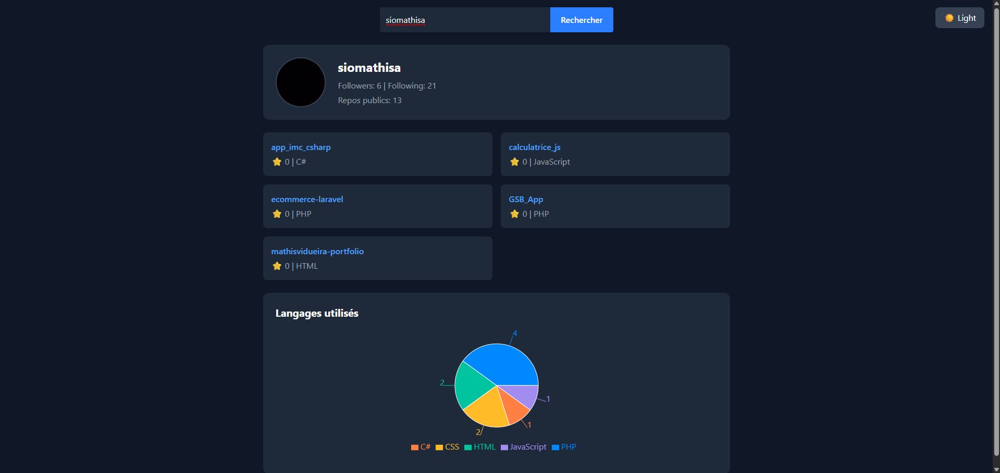

# 🚀 DevInsight

DevInsight est un dashboard d’analyse GitHub développé en **React + TypeScript**.  
Il permet d’analyser un profil GitHub en affichant :

- 📌 Informations utilisateur
- ⭐ Top 5 repositories (triés par stars)
- 🥧 Répartition des langages sous forme de graphique
- 🌙 Dark mode avec persistance (localStorage)

---

## 🎯 Objectif pédagogique

Ce projet a été réalisé afin de :

- Consolider mes compétences en React moderne
- Approfondir TypeScript (interfaces, typage strict, type-only imports)
- Structurer une application proprement
- Comprendre la séparation logique / UI
- Manipuler une API publique

J’ai utilisé ChatGPT comme **mentor technique** afin de :

- Comprendre les bonnes pratiques
- Structurer l’architecture correctement
- Approfondir les concepts React
- Apprendre en pratiquant

L’objectif n’était pas de copier-coller du code, mais de **comprendre chaque étape et améliorer ma rigueur technique**.

---

## 🏗️ Stack technique

- React
- TypeScript
- Tailwind CSS
- Recharts
- API publique GitHub

---

## 🧠 Architecture du projet
```bash
src/
│
├── components/
│ ├── ProfileCard.tsx
│ ├── RepoList.tsx
│ ├── LanguageChart.tsx
│
├── hooks/
│ └── useGithubUser.ts
│
├── services/
│ └── githubApi.ts
│
├── utils/
│ └── languageStats.ts
│
├── pages/
│ └── Dashboard.tsx
│
├── App.tsx
└── main.tsx
```

---

### 🔹 Séparation des responsabilités

- **services/** → gestion des appels API
- **hooks/** → logique métier (useGithubUser)
- **components/** → UI réutilisable
- **utils/** → transformation des données
- **pages/** → composition des composants

---

## 🔄 Fonctionnement global

1. L’utilisateur saisit un username GitHub
2. Le Dashboard appelle le hook `useGithubUser`
3. Le hook appelle le service API
4. Les données sont stockées dans le state
5. React déclenche un re-render
6. Les composants affichent les données

---

## 🚀 Fonctionnalités

- Recherche d’utilisateur GitHub
- Gestion loading / erreurs
- Top 5 repos par nombre de stars
- Graphique des langages (PieChart avec Recharts)
- Dark mode avec persistance via localStorage
- Interface responsive
- Architecture modulaire et scalable

---

## 📸 Aperçu



---

## ▶️ Installation

```bash
npm install
npm run dev
```